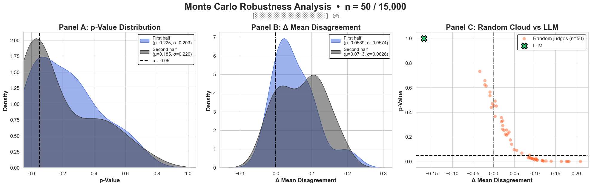

# When is an LLM-as-a-judge good enough?

<p align="left">
  <a href="xxxxxxxx.xx">
    
  </a>
  <a href="LICENSE">
    
  </a>
  
  
  
  
  
  
  
  
</p>

<p align="center">
  <a href="benchmarks/politifact/figures/gifs/monte_carlo_s3.gif">
    
  </a>
</p>

## Abstract

Generative AI models can automate evaluation tasks (e.g., judging the quality of model outputs), but only if their judgments are trustworthy. This repository studies **when an LLM-as-a-judge is “good enough”** by comparing how much it disagrees with humans against how much humans disagree with each other (“diversity of opinion”). If the LLM’s deviations are within typical inter-human variability (under a statistical decision rule), the LLM can be treated as *another reasonable judge* for that task.

> Paper: `xxxxxxxx.xx` (placeholder)

## Table of Contents

- [Quickstart](#quickstart)
- [Data format expectations](#data-format-expectations)
- [General approach: is the LLM "good enough"?](#general-approach-is-the-llm-good-enough)
- [API reference](#api-reference)
- [Benchmarks and reproducibility](#benchmarks-and-reproducibility)
- [Analysis methodologies (deep dive)](#analysis-methodologies-deep-dive)
- [Repository structure](#repository-structure)

## Quickstart

### Install

```bash
pip install -r requirements.txt
```

If you prefer conda:

```bash
conda create --name llm-good-enough python=3.11.9
conda activate llm-good-enough
pip install -r requirements.txt
```

### Minimal usage (LLM “good enough?”)

```python
import pandas as pd
from core.llm_good_enough import LLMGoodEnough

df = pd.read_csv("your_data.csv")

evaluator = LLMGoodEnough(
    df=df,
    human_cols=["human_#1", "human_#2", "human_#3"],
    llm_cols=["GPT_as_a_judge"],
    min_score=0,
    max_score=6,
)

evaluator.visualize_good_enough(
    llm_col="GPT_as_a_judge",
    y_lim=0.6,
)
```

### Running LLM-as-a-judge inference (optional)

```bash
cd core/llm_as_a_judge
python llm_as_a_judge.py
```

More detailed examples:
- `core/llm_good_enough/example.ipynb`
- `benchmarks/wmt-human/src/analysis.ipynb`
- `benchmarks/newsroom/src/analysis.ipynb`

## Data format expectations

Your `df` should contain:
- **Human rating columns** listed in `human_cols` (at least **2** columns).
- **LLM rating columns** listed in `llm_cols`.
- Numeric ratings on a shared ordinal scale defined by `min_score`…`max_score`.

Missing values are allowed, but rows with fewer than 2 non-missing human ratings are dropped internally (because no Human–Human disagreement can be computed).

## General approach: is the LLM "good enough"?

The goal is to test whether a language model's judgments align with human-level variability — i.e., whether it behaves like *another human judge* rather than a random or systematically biased rater.

<p align="center">
  
</p>

### 1) Measure inter-human disagreement

For each item, multiple human raters provide scores. All **pairwise absolute differences** between human scores are computed, forming a distribution that captures natural variability in human judgment (the “diversity of opinion”).

### 2) Measure LLM–human disagreement

For the same items, compute the **absolute difference** between each human score and the LLM’s score. This yields a second distribution describing how much the LLM diverges from humans.

### 3) Compare distributions statistically

A **Mann–Whitney U test** compares the two distributions:
- **H₀**: LLM–Human disagreement is *not greater* than Human–Human disagreement
- **H₁**: LLM–Human disagreement is *greater* than Human–Human disagreement

Decision rule:
- If **p ≥ 0.05**, we **fail to reject H₀** (no evidence the LLM diverges more than humans diverge from each other). This does **not** prove equivalence, but supports “good enough” as a practical rule.
- If **p < 0.05**, we reject H₀ (LLM diverges significantly more than humans do from each other).

### 4) (Optional) random baseline

To calibrate expectations, a **random judge** is simulated by assigning scores uniformly across the rating range. This baseline provides a clear “not good enough” contrast.

## API reference

The `LLMGoodEnough` class provides the following public methods:

### **Core Computation**

| Method | Description |
|--------|-------------|
| `compute_human_disagreements()` | Compute all pairwise absolute differences between human raters. Returns the "diversity of opinion" distribution. |
| `compute_llm_human_disagreements(llm_col)` | Compute absolute differences between a specific LLM and all human raters. |
| `compute_all_llm_disagreements()` | Compute LLM-human disagreements for all LLM columns at once. |
| `run_mannwhitneyu_test(llm_dis, human_dis)` | Run Mann-Whitney U test comparing LLM-human vs human-human disagreements. Returns p-value. |
| `summarize(llm_col)` | Print summary statistics (means, p-value) for a specific LLM. |

### **Visualization**

| Method | Description |
|--------|-------------|
| `visualize_good_enough(llm_col, y_lim)` | Main visualization comparing LLM vs random judge against human baseline. |
| `plot_judges_grid(y_lim)` | Grid comparing multiple LLM judges + random baseline in one figure. |
| `plot_monte_carlo_robustness(llm_col, iterations)` | Monte Carlo robustness analysis for a single LLM (3-panel figure). |
| `plot_monte_carlo_robustness_multi(llm_cols, iterations)` | Monte Carlo robustness analysis comparing multiple LLMs simultaneously. |

### **Human Stability Analysis**

| Method | Description |
|--------|-------------|
| `plot_human_stability_analysis()` | Test if humans are stable/coherent annotators using adaptive sampling until convergence. |
| `plot_llm_stability_analysis(llm_col)` | LLM stability analysis vs sample size (two-panel plot: acceptance rate + Δ mean disagreement). |
| `plot_human_stability_seed_robustness(n_seeds)` | Seed sensitivity analysis — test robustness of stability conclusions across multiple random seeds. |

### **Utility**

| Method | Description |
|--------|-------------|
| `reseed(new_seed)` | Reseed the random number generators for reproducibility or variation. |
| `init_random_judge(min_score, max_score)` | Initialize the random baseline judge column. |

## Benchmarks and reproducibility

This repository contains multiple benchmarks under `benchmarks/`, each with:
- `data/`: human & LLM ratings (`.csv`)
- `src/`: `preprocessing.ipynb`, `analysis.ipynb`
- `figures/`: generated plots (`pdf/`, `svg/`)

Scripts:
- `scripts/generate_all_gifs.sh`: generate all GIFs
- `scripts/generate_monte_carlo_gif.py`: generate Monte Carlo GIFs
- `scripts/render_mermaid_svg.sh`: render Mermaid `.mmd` → `.svg` (transparent background)

## Analysis methodologies (deep dive)

This section explains what the main analysis/plotting functions do and how to interpret the outputs.


### 1. Disagreement Distribution Comparison
Implemented in `visualize_good_enough()`, this plot directly compares the **distribution of human–human**, **LLM–human**, and **random–human** disagreements.  
It visually illustrates whether the LLM's disagreement pattern overlaps with natural human variability or drifts toward random behavior.

### 2. Multi-Model Comparison Grid
Implemented in `plot_judges_grid()`, this method extends the same logic to multiple candidate models.  
It allows quick visual comparison across several LLMs to identify which behave most like human judges.


### 3. Robustness Visualization
This section corresponds to `plot_monte_carlo_robustness()` and `plot_monte_carlo_robustness_multi()` in `core/llm_good_enough/evaluator.py`.

**What is randomized (important):** the Monte Carlo simulation repeatedly samples **fresh random judges**. The selected LLM’s disagreements are computed once from your data and shown as a fixed reference point (or multiple fixed points in the multi-LLM version).

**For each Monte Carlo draw (one random judge), two values are recorded:**
- The **Δ mean disagreement** = mean(Random–Human) − mean(Human–Human)  
- The **p-value** from a one-sided Mann–Whitney U test (`alternative="greater"`) comparing Random–Human vs Human–Human disagreements  

These values are aggregated across runs to generate the following three panels:

#### **Panel (A) — P-value Distribution**
**How it’s computed:**  
All *p*-values from repeated **random-judge** runs are collected and plotted as distributions (via kernel density estimation). The implementation also overlays a split-half diagnostic (first half vs second half) to check Monte Carlo stability.  

**Interpretation:**  
This panel shows how often a **random judge** looks “human-like” under the test.  
- If many values lie **above 0.05**, the test often fails to detect that random is worse than humans (low power / too little information).  
- If most values lie **below 0.05**, the test reliably rejects random as worse-than-human (a healthy sign that the setup has power).  

**Why it’s useful:**  
It’s a **sanity check**: with enough information, random judges should mostly be rejected (p-values concentrated below 0.05). The split-half overlay helps confirm the Monte Carlo estimate is stable.  

---

#### **Panel (B) — Δ Mean Disagreement Distribution**
**How it’s computed:**  
For each run, compute the Δ mean disagreement for the **random judge** relative to humans:  
\(\Delta = \mathbb{E}[|R - H|] - \mathbb{E}[|H_i - H_j|]\).  
The implementation uses a split-half diagnostic (first half vs second half) via KDE to check Monte Carlo stability.  

**Interpretation:**  
This panel shows the **effect size** distribution for random judges.  
- Δ mean ≈ 0 → random looks human-like on average (unexpected unless the task/humans are extremely noisy)  
- Δ mean > 0 → random disagrees more than humans (expected)  
- Δ mean < 0 → random disagrees less than humans (rare; suggests unusual scoring / data issues)  

**Why it’s useful:**  
It separates **statistical significance** (Panel A) from **practical magnitude** (Panel B). With enough data, random should be both “significant” and have a clearly positive Δ mean.  

---

#### **Panel (C) — Δ Mean vs P-value (Scatterplot)**
**How it’s computed:**  
Each Monte Carlo run provides a paired (Δ mean, *p*-value) for a **random judge**. These pairs are plotted as a cloud:
- x-axis = Δ mean (effect size)
- y-axis = *p*-value (significance)

The selected LLM judge is plotted as a **single point** (or multiple points in `plot_monte_carlo_robustness_multi()`), computed once from the observed LLM–Human disagreement distribution.  

**Interpretation:**  
This panel links the *size* of disagreement with the *strength* of statistical evidence for it.  
Points high on the plot (large *p*) indicate human-like behavior; points low and right (large Δ, small *p*) show strong divergence.

**Why it’s useful:**  
It bridges *practical difference* and *statistical certainty*, showing whether large deviations consistently translate into significant differences.  
Ideally, the LLM clusters near the top (non-significant, human-like) while the random judge clusters lower and farther right (significantly worse).

---

> **In essence:**  
> Panels (A), (B), and (C) together evaluate whether the LLM's disagreement pattern is *consistently within human variability*,  
> and whether that conclusion remains *robust* across randomized baselines.

---

### 4. Human Stability Analysis (random baseline)

Before evaluating an LLM judge, it’s critical to verify that the human annotations form a **usable baseline**. This analysis is a **power / sanity check** using a random judge: *“With increasing sample size, can we reliably reject a clearly bad (random) judge?”*

<p align="center">
  <a href="diagrams/svg/human_stability_analysis.svg">
    
  </a>
</p>

Implemented in `plot_human_stability_analysis()`, this method uses **adaptive sampling**: for each sample percentage, bootstrap iterations continue until the acceptance rate converges (split-half difference < threshold) rather than using fixed iteration counts.

**What is being measured (core idea):** how often a **random judge** looks “human-like” at different sample sizes.  
This is a *power / sanity-check*: with enough data, a random judge should be reliably rejected.

#### **How It Works**
For each percentage of sampled data (5%, 10%, …, 100%):
1. Bootstrap-sample that percentage of rows
2. Compute human–human and random-judge–human disagreements
3. Run a one-sided Mann–Whitney U test (`alternative="greater"`) comparing **Random–Human** vs **Human–Human** disagreements  
4. Record a boolean decision for that iteration: **accepted** if *p* > 0.05 (fail to reject “random is worse”), otherwise rejected  
5. Repeat until split-half acceptance rates converge (see below) or `max_iterations` is reached

**Acceptance rate (y-axis):**  
Plain text: `acceptance_rate = count(p_val > 0.05) / iterations`  
Math: $acceptance\_rate = \frac{\#\{p\_val > 0.05\}}{\text{iterations}}$  
Important: “accepted” here means **fail-to-reject**, not “proven human-like”.


**Convergence (adaptive sampling):**  
After `min_iterations`, the method checks every `check_interval` iterations whether the acceptance rate stabilized by splitting decisions into two halves and stopping when \(|mean_A - mean_B|\) falls below the effective threshold (absolute or relative via `relative_convergence`).

**What this test checks:**  
It checks whether the **random judge** tends to disagree with humans **more** than humans disagree with each other (one-sided MWU with `alternative="greater"`).

**What you can conclude (and what you can’t):**
- If the random judge is rejected more as sample size increases (acceptance rate goes down), the test has **power** at your dataset size, and the human ratings contain enough signal to distinguish “random” from “human-like”.
- This does **not** prove humans are “objective” in an absolute sense.
- It only indicates humans are **more self-consistent than a random rater**, and the dataset/test setup is usable for benchmarking LLM judges.

**What counts as “enough data” here (practical criterion):**
- You have “enough” data when, at high sample sizes (typically near **100%** of your dataset), the random judge is **consistently rejected** (acceptance rate is low) and the estimate **converges** (few/no red points).
- If acceptance stays high even at ~100%, the test has low power for this dataset/task (e.g., too few items, many missing ratings, humans very noisy, or the rating scale is too coarse), so “LLM is good enough” conclusions should be treated cautiously.

**Important nuance:** increasing the sampled percentage does not necessarily make humans “agree more” (Human–Human disagreement can stay high if the task is subjective). What improves with more data is that the **estimate becomes less noisy** and the MWU test gains **power**, so rejection/acceptance outcomes become more stable.

**Why percentages > 100% can still be run (and how to interpret them):**
- The method uses **bootstrap sampling with replacement**, so asking for more than 100% simply means drawing **more rows with duplicates** (an “effective sample size” larger than the dataset).
- This can be useful as a *sensitivity check* for “what would happen if we had more observations from the same underlying process”.
- But it does **not** create new information: it can make the test look artificially more confident, so it should not be interpreted as equivalent to collecting more real, independent data.
- If acceptance only approaches ~0 when going above 100%, that suggests **more real (independent) data would likely help**, but the main “do we have enough data?” call should still be judged by behavior near **~100%** plus convergence.

#### **What the Plot Shows**
- **X-axis:** Percentage of the dataset sampled
- **Y-axis:** Acceptance rate (how often the random judge is "accepted" as human-like)
- **Green dot:** Converged — the acceptance rate stabilized
- **Red dot:** Max iterations reached — did not converge
- **Annotations:** Number of iterations needed (reveals "difficulty" per sample size)

#### **Interpretation — Trend Patterns**

| Trend | Meaning |
|-------|---------|
| **Downhill** (high→low) | Expected for random judges. MWU test gains power with more data — humans are distinguishable from random. ✅ Methodology working. |
| **Flat high** (~1.0) | Random judge always accepted — humans are too noisy to distinguish from random. ⚠️ Dataset may not be suitable. |
| **Flat low** (~0.0) | Random judge always rejected — humans are very consistent. ✅ Strong baseline. |
| **Uphill** | Suspicious — investigate data quality. |
| **Erratic** (many red) | High variance — may need more data or iterations. |

> **Key insight:** A **converging downtrend** confirms three things:
> 1. ✅ **Enough data** — the statistical test gains power with larger samples
> 2. ✅ **Reliable humans** — annotators share a consistent judgment pattern (not random noise)
> 3. ✅ **Valid baseline** — the dataset is suitable for benchmarking LLM judges
>
> If humans were just noise (like the random judge), acceptance would stay flat and high (~1.0) regardless of sample size — because you can never distinguish noise from noise.

---

### 5. LLM Stability Analysis (sample size vs “good enough?”)

This section corresponds to `plot_llm_stability_analysis(llm_col)`.

**Goal:** determine whether the *LLM “good enough” decision* is stable as sample size increases (and quantify practical deviation via effect size).

**Outputs (two-panel figure):**
- **Panel A — Acceptance rate vs sample %**: how often the LLM is “accepted” (p > 0.05) across bootstrap iterations at each sample size.
- **Panel B — Δ mean disagreement vs sample %**:  
  Plain text: `Δ = mean(|LLM - H|) - mean(|H_i - H_j|)`  
  Math: $\\Delta = \\mathrm{mean}(|LLM-H|) - \\mathrm{mean}(|H_i-H_j|)$

**Interpretation (rule of thumb):**
- Acceptance stays high near ~100% **and** Δ stays near 0 → robustly “good enough”.
- Acceptance drops as sample size increases (often with Δ > 0) → small-sample acceptance was likely due to low power; the LLM is not robustly human-like.

**How to read Δ:**
- **Δ ≈ 0**: LLM deviations are about the same magnitude as human–human variability (good sign).
- **Δ > 0**: LLM disagrees more than humans disagree with each other (practically worse).
- **Δ < 0**: LLM is more “consistent” than humans (not automatically better; could be overly conservative).

---

### 6. Seed Sensitivity Analysis

Results can vary across different random initializations. The **Seed Sensitivity Analysis** tests how robust conclusions are across multiple seeds.

Implemented in `plot_human_stability_seed_robustness(n_seeds)`, this method:
1. Runs the stability analysis with N different random seeds
2. Collects acceptance rates for each percentage across all seeds
3. Plots mean ± confidence interval

#### **What the Plot Shows**
- **Blue band:** 95% CI across seeds
- **Blue line:** Mean acceptance rate
- **Annotations:** % of seeds that converged at each sample size

#### **Interpretation**

| Pattern | Meaning |
|---------|---------|
| Tight CI band | Robust conclusion — doesn't depend on random seed ✅ |
| Wide CI band | Sensitive to initialization — results may be unstable ⚠️ |
| Consistent downhill trend | Methodology is reliable across seeds ✅ |
| High convergence % (green annotation) | Estimates are stable at that sample size |
| Low convergence % (orange annotation) | That sample size is noisy/difficult |

> **In essence:** This analysis confirms whether your stability conclusions hold regardless of which random seed you happened to use.

## Repository structure

```text
LLM-AS-A-JUDGE-GOOD-ENOUGH
│
├── README.md
├── requirements.txt
├── __init__.py
│
├── core/                          # Main library code
│   ├── llm_as_a_judge/            # LLM inference module
│   │   ├── inference.py
│   │   └── llm_as_a_judge.py
│   └── llm_good_enough/           # Evaluation framework
│       ├── __init__.py
│       ├── evaluator.py
│       └── example.ipynb
│
├── benchmarks/                    # Datasets + analysis notebooks
├── diagrams/                      # Methodology diagrams (mermaid/, svg/)
├── docs/                          # Extended documentation
└── scripts/                       # Utilities (GIF generation, diagram rendering)
```
