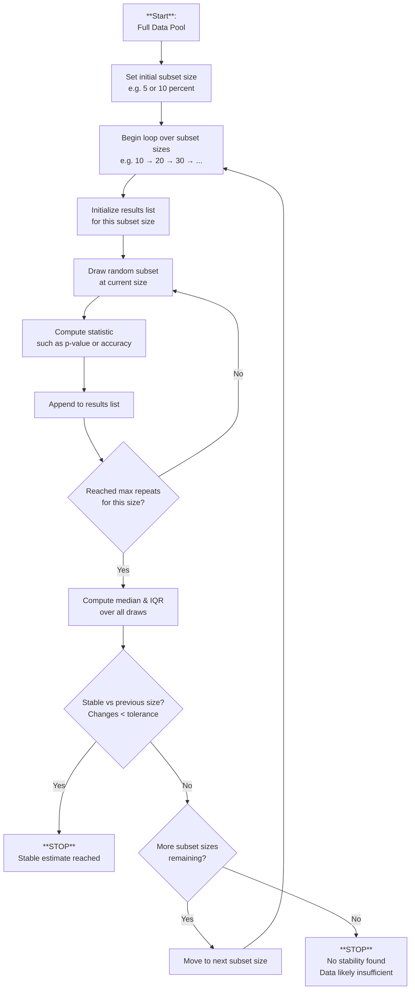

### Summary of [“Adaptive sampling methods facilitate the determination of reliable dataset sizes for evidence-based modeling”](https://www.frontiersin.org/journals/bioinformatics/articles/10.3389/fbinf.2025.1528515/full)

### Overview
The paper studies how to determine the amount of data needed for reliable statistical or modeling conclusions. It proposes an adaptive sampling framework that avoids arbitrary choices of dataset size or bootstrap repetition counts.

### Key Idea
Instead of fixing a large number of bootstrap samples, the method:
- draws subsets of increasing size from the data pool,
- performs repeated resampling for each size,
- measures model/statistical performance,
- and stops when the resulting metrics stabilize.

The ***central idea*** is to detect when adding more data (larger subsets) or more repetitions (more resamples) no longer meaningfully changes the statistical estimates — indicating the analysis has become stable.

### ***Core Procedure (Algorithm 1)***
---
1. Given a large **“data pool”**, repeatedly draw **random subsets** of **increasing size** (e.g. 10%, 20%, 30%, … of the pool).  
   These subset sizes define the **outer loop** of the algorithm.

2. For each subset size, perform **multiple independent samplings** (i.e. multiple random draws).  
   For each draw:  
   - fit the model or compute the **statistic of interest** (e.g., accuracy, loss, coefficient, p-value),  
   - **record the outcome**.  
   These repeated draws form the **inner loop**, capturing sampling variability.

3. For each subset size, compute **summary statistics** across all repeated draws:  
   - **median** → the typical performance/value,  
   - **interquartile range (IQR)** → sampling variability / uncertainty.  
   Together these quantify both **central tendency** and **stability** of the statistic at that data size.

4. Check whether these summary statistics have changed less than a **predefined tolerance** relative to the previous subset size.  
Stability means:
```text
|median_current − median_previous| < tolerance
and
|IQR_current − IQR_previous| < tolerance
```
- If **yes → stop** (further data or sampling will not meaningfully change the estimate).  
- If **no → continue**, increasing either the subset size or the number of repeated samplings.

5. Once **stability** is reached, optionally **extrapolate** (e.g., using a **power-law fit**) to estimate the **asymptotic performance** or **uncertainty** expected with very large or infinite data.  
This helps assess whether collecting more data is worthwhile and what ultimate performance bounds look like.


---

#### **Python implementation**
```python
from __future__ import annotations
import numpy as np
from typing import Callable, Dict, List, Any, Optional


def draw_subset(data: np.ndarray, fraction: float) -> np.ndarray:
    """
    Draw a random subset of the dataset.

    Parameters
    ----------
    data : np.ndarray
        Full dataset, typically of shape (N, features) or similar.
    fraction : float
        Fraction of the dataset to sample (0 < fraction <= 1).

    Returns
    -------
    np.ndarray
        Randomly drawn subset of size floor(N * fraction).
    """
    n = int(len(data) * fraction)
    idx = np.random.choice(len(data), n, replace=False)
    return data[idx]


def summarize(values: List[float]) -> Dict[str, float]:
    """
    Compute summary statistics: median and interquartile range (IQR).

    Parameters
    ----------
    values : List[float]
        List of metric values obtained from repeated sampling.

    Returns
    -------
    Dict[str, float]
        Dictionary with:
        - "median": median value
        - "iqr": interquartile range (75th - 25th percentile)
    """
    arr = np.asarray(values)
    median = float(np.median(arr))
    q25 = float(np.percentile(arr, 25))
    q75 = float(np.percentile(arr, 75))
    return {"median": median, "iqr": q75 - q25}


def is_stable(
    current: Dict[str, float],
    previous: Optional[Dict[str, float]],
    tol: float
) -> bool:
    """
    Check whether two summary-statistic states are 'stable enough'.

    Parameters
    ----------
    current : Dict[str, float]
        Current summary statistics (median, IQR).
    previous : Dict[str, float] or None
        Previous summary statistics for comparison.
    tol : float
        Absolute tolerance threshold for both median and IQR convergence.

    Returns
    -------
    bool
        True if both median and IQR change less than the tolerance.
    """
    if previous is None:
        return False

    median_stable = abs(current["median"] - previous["median"]) < tol
    iqr_stable = abs(current["iqr"] - previous["iqr"]) < tol
    return median_stable and iqr_stable


def adaptive_sampling(
    data: np.ndarray,
    stat_func: Callable[[np.ndarray], float],
    subset_sizes: np.ndarray = np.linspace(0.1, 0.9, 9),
    max_repeats: int = 50,
    tol: float = 1e-3
) -> List[Dict[str, Any]]:
    """
    Perform adaptive sampling to determine the dataset size required
    for stable statistical estimates, as described in the paper
    "Adaptive sampling methods facilitate the determination of reliable dataset sizes
    for evidence-based modeling" (Frontiers, 2025).

    Parameters
    ----------
    data : np.ndarray
        Full dataset to subsample from.
    stat_func : Callable[[np.ndarray], float]
        Function that computes the statistic or model performance
        on a given subset of the data.
    subset_sizes : np.ndarray, optional
        Array of fractions (0–1) representing increasing dataset sizes
        to evaluate. Default is 10% to 90% in 10% increments.
    max_repeats : int, optional
        Maximum number of resamples for each subset size.
    tol : float, optional
        Convergence tolerance for stability of summary statistics.

    Returns
    -------
    List[Dict[str, Any]]
        History list, where each entry contains:
        - "size": float, the subset fraction
        - "stats": Dict[str, float], summary statistics at this size
        - "n_repeats": int, number of repetitions performed
        - "values": List[float], raw metric values from sampling
    """
    previous_stats: Optional[Dict[str, float]] = None
    history: List[Dict[str, Any]] = []

    for size in subset_sizes:

        values: List[float] = []
        stable_at_this_size = False

        for _ in range(max_repeats):
            subset = draw_subset(data, size)
            metric = float(stat_func(subset))
            values.append(metric)

            current_stats = summarize(values)

            # Inner-loop stability check for this subset size
            if is_stable(current_stats, previous_stats, tol):
                stable_at_this_size = True
                break

        history.append({
            "size": size,
            "stats": current_stats,
            "n_repeats": len(values),
            "values": values.copy(),
        })

        # Outer-loop stability: if stable, stop early
        if stable_at_this_size:
            print(f"Stability reached at subset size {size:.2f}")
            break

        previous_stats = current_stats

    return history

```

### Why Stability Between Subset Sizes Implies “Enough Data”
When the adaptive sampling algorithm finds that summary statistics (median, IQR, etc.) **no longer change** between consecutive subset sizes, this is taken as evidence that the statistic has entered a **stable regime**. In this regime, adding more data does not materially change the estimate.

This is valid because:

- Small subsets produce large variability due to sampling noise.
- As subset size increases, the sampling distribution narrows.
- Eventually, additional data yields **diminishing returns**.
- Once the statistic stops changing within a tolerance, it is effectively **converged** for practical purposes.

In other words, the statistic becomes **insensitive to sampling randomness** when enough data has been included.

---

### Connection to the Law of Large Numbers
This idea is closely related to the **Law of Large Numbers (LLN)**.

LLN states that, as sample size increases:
- the sample average converges to the true expected value,
- sampling noise shrinks,
- estimates become more stable.

The adaptive sampling method generalizes this principle to any statistic:
- accuracy
- loss
- p-values (after transformation)
- regression coefficients
- effect sizes
- etc.

These quantities also have sampling distributions that **concentrate as n grows**. Therefore, stability across subset sizes reflects the same underlying phenomenon as LLN:  
**convergence toward the true underlying value**.

---

### Convergence Concepts Involved
The stability criterion is supported by key statistical principles:

- **Convergence rate of estimators:**  
  Many estimators converge at a rate proportional to **1 / sqrt(n)**.  
  This means improvements naturally shrink as the sample size grows.

- **Asymptotic normality:**  
  For many estimators, the quantity  
  **sqrt(n) * (estimate - true_value)**  
  approaches a normal distribution as n increases.  
  This implies the variance of the estimator decreases roughly like **1 / n**.


- **Bias–variance dynamics**: as data grows, variance shrinks and the estimator enters a region where additional data has negligible effect.

Together, these results explain **why performance curves flatten** and why detecting this flattening is a reliable indicator of “enough data.”

---

### Intuition
Stability detection means:

- The difference between **median(n_k)** and **median(n_{k+1})** is tiny.
- The difference between **IQR(n_k)** and **IQR(n_{k+1})** is tiny.
- The learning curve has **flattened**.
- You are in the **asymptotic regime** where more data yields minimal improvement.

Practically, this tells us:
> Additional data will not meaningfully change the result under the chosen model/statistic.

---


### Why It Matters
- Fixed bootstrap counts are often inefficient: too few → unstable outcomes; too many → wasted computation.  
- The adaptive method ensures stability-driven determination of both dataset size and number of resamples.  
- Works across modeling types (ML models, mechanistic models, statistical estimators).

### Key Contributions
- Introduces a general adaptive framework for determining required dataset size.  
- Demonstrates that stability-based stopping is more reliable than fixed bootstrap approaches.  
- Provides a Python implementation.  
- Enables estimation of how much more data would be required to reach a desired uncertainty level.

### Practical Implications
- There is no universal number of bootstrap samples one should use.  
- The “correct” number is the one at which relevant statistics stabilize.  
- Learning-curve stabilization provides a data-driven way to determine if more data collection is useful.


#### ***Our Approach Here***

NOTE:
- loop through reseeded judges (variation happens here) manually set n = 1000 to start with or even way more
-> the larger k the samller diffs

- sample size fixed = 100% data

keep llmn human constand (computed once)

in loop:

1) compute p value & mean diff same as panel for judge vs human (10.000 x)

diversity of opionion human (mean) - judge  --> check direction

= 10.000 delta means & pvals


Now divide by 2 and plot each in seperate plot()

-> look at absolute difference between diffs 

-> if deviate too much then keep repeating

-> once we think we have repeated enough we though 5.000 & 5.000 together again and plot

**key** is to evalaute judge and cofrim that random judges across seeds remain conistentantly good or bad!


we want to see difference in delta means between random judge and human human


if no gap?
    seciond part of analysis:
        - human guessing?


to summarise panel a and b:
- plot distribution of pvalue (panel a)
- mean diff (panel b)